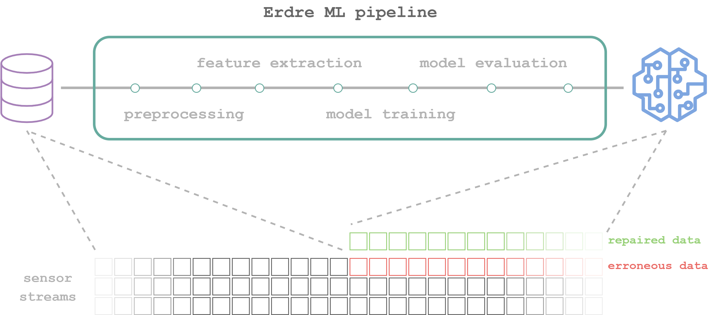

# Erdre - Erroneous data repair for Industry 4.0.

---

**UPDATE**: Erdre has been forked to [d2m](https://github.com/SINTEF-9012/d2m), where we continue the development of a more general machine learning pipeline for tabular and time series data, expanding beyond the scope of erroneous data repair.

---

A machine learning pipeline enabling Responsible AI:

- **Explainable AI**, using SHAP, LIME or both.
- **Uncertainty estimation**, using Bayesian dropout for neural networks.
- **Carbon emissions tracking and reporting**, using [CodeCarbon](https://codecarbon.io/).

**Erdre** lets you easily create and evaluate machine learning models for tabular and time series data, with built-in data profiling and feature engineering.



## Usage

Tested on:

- Linux
- macOS
- Windows with WSL 2


1. Clone/download this repository.
2. Place your datafiles (csv) in a folder with the name of your dataset (`DATASET`) inside `assets/data/raw/`, so the path to the files is `assets/data/raw/[DATASET]/`.
3. Update `params.yaml` with the name of your dataset (`DATASET`), the target variable, and other configuration parameters.
4. Build Docker container:

```
docker build -t d2m -f Dockerfile .
```

5. Run the container:

```
docker run -p 5000:5000 -it -v $(pwd)/assets:/usr/d2m/assets -v $(pwd)/.dvc:/usr/d2m/.dvc d2m
```

6. Open the website at localhost:5000 to use the graphical user interface.


### Creating models on the command line


7. Copy `params.yaml` from the host to the container (find `CONTAINER_NAME` by running `docker ps`):

```
docker cp params.yaml  [CONTAINER_NAME]:/usr/d2m/params.yaml
```

8. Inside the interactive session in the container, run:

```
docker exec [CONTAINER_NAME] dvc repro
```
